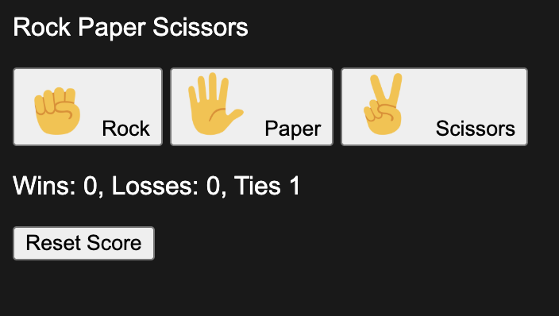

# Rock Paper Scissors 🎮✋✌️

An interactive **Rock Paper Scissors** game built with **HTML, CSS, and JavaScript**.  
Play against the computer, track your score, and enjoy a clean, beginner-friendly interface.

## ▶️ Live Demo
👉 **Play Here:** https://breiajohn.github.io/Rock-paper-scissors-2/

## 📸 Preview

## ✨ Features
- Clickable image buttons for Rock, Paper, and Scissors
- Randomized computer opponent
- Instant win / lose / tie feedback
- Score tracking
- Clean and responsive UI

## 🛠️ Built With
- **HTML** – structure and layout  
- **CSS** – styling and hover effects  
- **JavaScript** – game logic and DOM manipulation  

## 📖 How to Play
1. Click **Rock**, **Paper**, or **Scissors**
2. The computer randomly selects a move
3. The result is displayed instantly
4. Keep playing to improve your score!

## 🚀 What I Learned
- DOM manipulation and event handling
- Writing clean, reusable JavaScript functions
- Connecting JavaScript logic to UI interactions
- Using Git, GitHub, and GitHub Pages for deployment

## 📂 Project Structure
